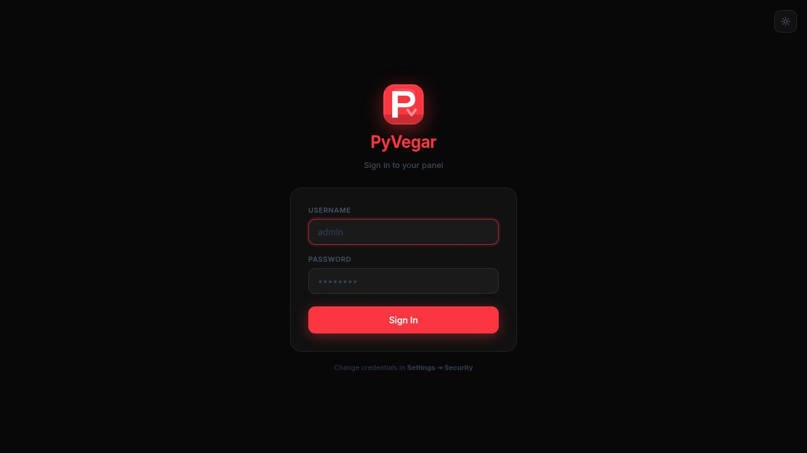

<div align="center">
  
  <h1>PyVegar V3</h1>
</div>

[](version.json)
[](LICENSE)
[](https://python.org)
[](https://fastapi.tiangolo.com)
[](https://github.com/FreeCode911/PyVeger/stargazers)
[](https://github.com/FreeCode911/PyVeger/commits/main)

> **PyVegar V3** is a sleek, self-hosted web management panel for running and monitoring Python bots, scripts, and services. Manage multiple projects, edit files in-browser, stream live logs, expose via Cloudflare tunnels, and control everything from Discord — all from a beautiful dark/light UI that works on desktop and mobile.

---

## ✨ Features

- ⚡ **SPA Navigation** — Single-page app router with animated progress bar and fade transitions; no full page reloads
- 🔐 **End-to-End Security** — bcrypt password hashing, login rate-limiting, security headers (CSP, HSTS, X-Frame-Options), hardened session cookie
- 🐍 **Multi-Project Management** — Create, start, stop, restart, and delete Python projects; UUID-based project IDs
- 📁 **Full File Manager** — Recursive folder tree, create files/folders inside subfolders, rename, move, delete, upload
- 📝 **In-Browser Editor** — Syntax-aware textarea with Tab indentation and Ctrl+S save
- 📊 **Live Stats** — Real-time CPU/RAM via WebSocket (1 s interval)
- 🟢 **Real-Time Status Badge** — Project status updates live — running, restarting, error, stopped
- ⏱️ **Live Uptime Tile** — Server info card shows formatted uptime updated every second
- 📋 **Live Console** — WebSocket log streaming with clear button and auto-scroll
- 📦 **Package Manager** — Install/uninstall pip packages directly from the panel
- 🌐 **Cloudflare Quick Tunnel** — No account needed, one-click temporary public URL via trycloudflare.com
- 🔒 **Cloudflare Account Tunnels** — Create named tunnels via CF API, persistent URLs on your own domain; start/stop/delete from the panel
- 🤖 **Discord Bot** — Full slash command suite: start, stop, restart, logs, files, edit files, system stats
- 🟩 **Install Runtime** — Install Node.js directly from Settings: tries NVM first, falls back to standalone binary; live install log stream
- 🎨 **Imperial Red + Night Theme** — Pure `#FB3640` accent and `#080808` background throughout
- 🖼️ **Favicon** — PyVegar logo shown in browser tab on all pages
- 📱 **Fully Responsive** — Works on desktop and mobile with adaptive layouts

---

## 🖼️ Screenshots

### Login


### Dashboard · Server Manager · Settings
| Dashboard | Server Manager | Settings |
|-----------|---------------|----------|
|  |  |  |

### File Manager · Live Logs · Mobile
| File Manager | Live Logs | Mobile Dashboard | Mobile Files |
|-------------|-----------|-----------------|--------------|
|  |  |  |  |

---

## 🚦 Quickstart

```bash
git clone https://github.com/FreeCode911/PyVeger.git
cd PyVeger
pip install -r requirements.txt
python app.py
```

Then open [http://localhost:8000](http://localhost:8000) — default login is `admin` / `admin`.

---

## 🔑 Default Credentials

| Field | Value |
|-------|-------|
| Username | `admin` |
| Password | `admin` |

> Change these in **Settings → Security** immediately after first use.

---

## 🧭 Project Structure

```
PyVegar/
├── app.py              # FastAPI app — routes, auth middleware, WebSockets
├── manager.py          # Project lifecycle, file/folder ops, process control
├── log_config.py       # Coloured log formatter + PyVegar startup banner
├── tunnel.py           # Cloudflare quick tunnel + account tunnel API
├── discord_bot.py      # Discord bot slash commands
├── config.json         # Credentials (bcrypt-hashed), tokens, CF tunnel data
├── database.json       # Project metadata (status, PID, start file, restarts)
├── version.json        # Version history shown in Settings → About
├── runtimes_cache.json # Detected runtimes (auto-generated on first boot)
├── requirements.txt    # Python dependencies
├── templates/          # Jinja2 HTML (login, index, server, logs, settings)
├── static/             # Static assets (tw.css, logo.svg, spa.js)
├── scripts/            # Project files — each project in its own UUID subfolder
├── logs/               # Per-project log files (UUID-named)
└── bin/                # Locally installed runtime binaries (e.g. node)
```

---

## 🛠️ Tech Stack

| Layer | Tech |
|-------|------|
| Backend | Python 3.11, [FastAPI](https://fastapi.tiangolo.com/) |
| Frontend | HTML5, CSS variables, [Lucide Icons](https://lucide.dev/), vanilla SPA router |
| Realtime | FastAPI WebSockets — logs + stats, 1 s push interval |
| Security | bcrypt, slowapi rate-limiting, SecurityHeaders middleware |
| Tunneling | Cloudflare cloudflared + Cloudflare API |
| Bot | [discord.py](https://discordpy.readthedocs.io/) |
| Process | psutil, subprocess |

---

## 🔐 Security

PyVegar V3.2 ships with multiple security layers enabled by default:

| Layer | Detail |
|-------|--------|
| Password hashing | bcrypt (`$2b$12$`) — migrated automatically on first boot |
| Login rate-limiting | 5 failed attempts → 5-minute lockout per IP |
| Security headers | CSP, HSTS, X-Frame-Options, X-Content-Type-Options, Referrer-Policy |
| Session cookie | `samesite=strict`, `httponly`, `secure` |
| Password change | Settings → Security — current password required, strength meter shown |

---

## 🎨 Server Log Format

PyVegar V3 uses a structured, colour-coded log format with an ASCII banner on every startup:

```
  ━━━━━━━━━━━━━━━━━━━━━━━━━━━━━━━━━━━━━━━━━━━━━━━━━━━━━━━━━━━━━━━━
    ██████╗ ██╗   ██╗██╗   ██╗███████╗ ██████╗  █████╗ ██████╗
    ██╔══██╗╚██╗ ██╔╝╚██╗ ██╔╝██╔════╝██╔════╝ ██╔══██╗██╔══██╗
    ██████╔╝ ╚████╔╝  ╚████╔╝ █████╗  ██║  ███╗███████║██████╔╝
    ██╔═══╝   ╚██╔╝    ╚██╔╝  ██╔══╝  ██║   ██║██╔══██║██╔══██╗
    ██║        ██║      ██║   ███████╗╚██████╔╝██║  ██║██║  ██║
    ╚═╝        ╚═╝      ╚═╝   ╚══════╝ ╚═════╝ ╚═╝  ╚═╝╚═╝  ╚═╝
    Server Management Panel  ·  Python · FastAPI · SQLite
  ━━━━━━━━━━━━━━━━━━━━━━━━━━━━━━━━━━━━━━━━━━━━━━━━━━━━━━━━━━━━━━━━

  10:33:49  ● INFO   uvicorn  ▶ Started   PID 42053
  10:33:49  ● INFO   uvicorn  ✔ Ready     application startup complete
  10:33:49  ● INFO   uvicorn  ◉ Listening  http://0.0.0.0:8000
  10:33:50  ● INFO   http     GET     /login                 →  200
  10:33:52  ● INFO   http     POST    /login                 →  303
  10:33:53  ▲ WARN   tunnel   Tunnel exited after 0.1s — invalid token
```

| Symbol | Level |
|--------|-------|
| `●` blue | INFO |
| `▲` yellow | WARNING |
| `✖` red | ERROR / CRITICAL |

HTTP status colours: `2xx` green · `3xx` blue · `4xx` yellow · `5xx` red

---

## 🌐 Cloudflare Tunnels

### Quick Tunnel (no account)
1. Go to **Settings → Quick Tunnel**
2. Enter your local port and click **Start**
3. A temporary `*.trycloudflare.com` URL is generated — changes on every restart

### Account Tunnels (persistent URL on your domain)
1. Go to **Settings → Cloudflare Account Tunnels**
2. Enter your **Account ID** (CF Dashboard → right sidebar) and an **API Token** with:
   - `Cloudflare Tunnel:Edit`
   - `DNS:Edit`
   - `Zone:Read`
3. Click **Save & Connect** — your domains load automatically
4. Click **New Tunnel**, pick a subdomain + domain + port
5. The panel creates the tunnel, configures ingress, and adds the DNS CNAME record
6. Click **Start** — your service is live at `https://subdomain.yourdomain.com`

---

## 🟩 Install Runtime

Settings → Install Runtime lets you install language runtimes without any system permissions.

### Node.js
1. Go to **Settings → Install Runtime**
2. Click **Install** next to Node.js
3. The panel tries **NVM** first (`nvm install 24`); if that fails it downloads the standalone binary from nodejs.org (`node-v26.0.0-linux-x64.tar.xz`)
4. A live install log streams in real time with colour-coded output
5. The badge updates to **NVM** or **Standalone** once installed
6. Click **Remove** to clean up the managed binary at any time

---

## 🤖 Discord Bot

1. Create a bot at [discord.com/developers/applications](https://discord.com/developers/applications)
2. Copy the bot token and paste it in **Settings → Discord Bot**
3. Add allowed Discord user IDs or usernames (comma-separated)
4. Invite the bot to your server

Available slash commands:

| Command | Description |
|---------|-------------|
| `/projects` | List all servers with status, uptime, PID |
| `/status <project>` | Detailed info + Start / Stop / Restart / Logs buttons |
| `/start <project>` | Start a stopped server |
| `/stop <project>` | Stop a running server |
| `/restart <project>` | Restart a server |
| `/restart_all` | Restart all running servers |
| `/logs <project> [lines]` | View recent log lines (up to 50) |
| `/files <project>` | List all files in a project |
| `/editfile <project> <file>` | Edit a file directly from Discord |
| `/system` | CPU, RAM, disk usage + tunnel status |
| `/help` | Show all commands |

---

## 📱 Mobile Support

PyVegar V3 is fully responsive:
- **Dashboard** — card grid adapts to single column on small screens
- **File Manager** — master-detail view: tap a file to open the editor full-screen
- **Settings** — all forms stack to single column
- **Logs** — full-screen terminal view on any device

---

## 📚 Usage Examples

```bash
# Start the panel
python app.py

# Access locally
http://localhost:8000

# Make public via quick tunnel
Settings → Quick Tunnel → Start

# Create a project
Dashboard → New Server → name it → Manage → upload/create files → Start

# Install a package into a project
Server page → Packages tab → type package name → Install

# Install Node.js runtime
Settings → Install Runtime → Node.js → Install
```

---

## 📋 Changelog

### V3.3 — Current

- **Install Runtime section** — Settings → Install Runtime: install Node.js with one click; tries NVM (`nvm install 24`) first, falls back to standalone binary (`node-v26.0.0-linux-x64.tar.xz` from nodejs.org); live colour-coded install log streamed via WebSocket
- **Save Settings fix** — resolved JS error that prevented the Settings save button from working when credential fields were absent from the DOM
- **Runtime detector update** — `_get_node_status` now checks standalone binary → NVM versions → system PATH in order; badge correctly reports source (`Standalone`, `NVM`, `System`)

### V3.2

- **SPA navigation** — Full single-page app router (`static/spa.js`): animated Imperial Red progress bar, 125 ms fade transitions, click interception, browser back/forward via `popstate`
- **Ghost-free WebSockets** — `PV3.onNavigate` cleanup registry fires before every page swap, closing all WS connections and clearing timers to prevent duplicate reconnect loops
- **End-to-end security** — bcrypt password hashing (auto-migrated on boot), login rate-limiting (5 attempts → 5-min lockout per IP), `SecurityHeadersMiddleware` (CSP, HSTS, X-Frame, X-Content-Type, Referrer-Policy), session cookie hardened to `samesite=strict`
- **Security panel** — Settings → Security: change password with live strength bar, security status pills, lockout warning + remaining-attempts counter on login page

### V3.1

- **New panel logo** — Solid-filled PV monogram (professional panel style), transparent variant (`logo-transparent.svg`), and SVG favicon on every page
- **Floating taskbar** — Curved pill-shaped navbar with backdrop blur, Imperial Red border glow, and drop shadow; consistent height and style on all pages
- **Imperial Red + Night theme** — Pure `#FB3640` accent and `#080808` background throughout; zero green tints or colour mixing
- **GitHub update check** — Settings → About shows current commit hash with a **Check** button (GitHub API) and **Update Now** button (runs `git pull`)
- **Mobile taskbar** — Pill reverts to flat full-width bar on small screens for a clean mobile layout
- **Restart All fix** — Fixed async blocking issue and JS error that prevented Restart All from working

### V3.0

- **Modern server logs** — colour-coded output (`log_config.py`): level badges (`●` `▲` `✖`), parsed HTTP lines, WebSocket events, PyVegar ASCII banner on startup
- **Real-time status badge** — WebSocket stats payload includes project `id`; status badge updates every 1 s
- **Live uptime tile** — server info card shows formatted uptime (`2h 14m`, `45s`) refreshed every second
- **UUID project IDs** — projects keyed and folder-named by UUID for full portability
- **Auto-restart** — processes that crash are automatically restarted with configurable delay

---

## 🧑‍💻 Contributing

Pull requests are welcome. For significant changes, open an issue first to discuss what you'd like to change.

---

## 📝 License

**Personal Use Only.** Commercial, educational, or organizational use requires the author's permission. See [`LICENSE`](LICENSE) for full terms.

---

## 📫 Contact

Questions or bug reports? [Open an issue](https://github.com/FreeCode911/PyVeger/issues)
