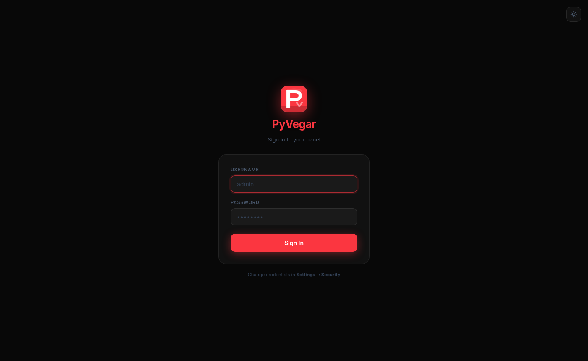
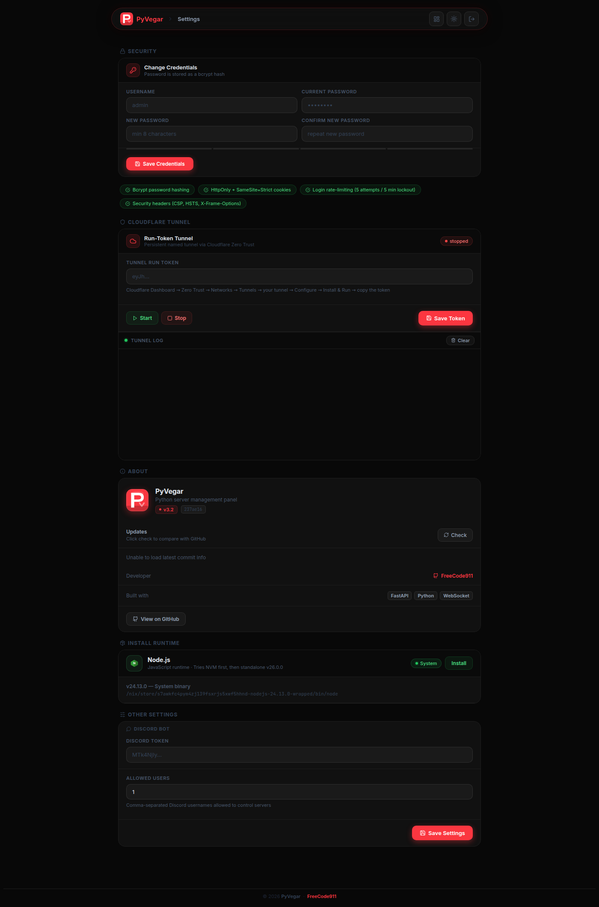

<div align="center">
  
  <h1>PyVegar</h1>
</div>

[](version.json)
[](LICENSE)
[](https://python.org)
[](https://fastapi.tiangolo.com)
[](https://github.com/FreeCode911/PyVeger/stargazers)
[](https://github.com/FreeCode911/PyVeger/commits/main)

> **PyVegar** is a sleek, self-hosted web management panel for running and monitoring bots, scripts, and services in any language. Manage multiple projects, edit files in-browser, stream live logs, install runtimes, expose via Cloudflare tunnels, and control everything from Discord — all from a beautiful dark/light UI that works on desktop and mobile.

---

## ✨ Features

- ⚡ **SPA Navigation** — Single-page app router with animated progress bar and fade transitions; no full page reloads
- 🔐 **End-to-End Security** — bcrypt password hashing, login rate-limiting, full security headers (CSP, HSTS, X-Frame-Options), hardened session cookie
- 🖥️ **Multi-Project Management** — Create, start, stop, restart, and delete projects in any language; UUID-based IDs, custom startup command or start file
- 📁 **Full File Manager** — Recursive folder tree, create files/folders anywhere, rename, move, delete, upload
- 📝 **In-Browser Editor** — Syntax-aware textarea with Tab indentation and Ctrl+S save
- 📊 **Live Stats** — Real-time CPU/RAM via WebSocket (1 s interval)
- 🟢 **Real-Time Status Badge** — Project status (running, restarting, error, stopped) updates live every second
- ⏱️ **Live Uptime** — Formatted uptime counter updated every second on the server card
- 📋 **Live Console** — WebSocket log streaming with clear button and auto-scroll
- 📦 **Package Manager** — Install/uninstall pip packages directly from each project's page
- 🟩 **Install Runtime** — Install Node.js from Settings with one click: tries NVM first, falls back to standalone binary; live colour-coded install log
- 🌐 **Cloudflare Run-Token Tunnel** — Paste your tunnel run token and start/stop directly from Settings
- 🤖 **Discord Bot** — Full slash command suite: list, start, stop, restart, logs, file editing, system stats
- 🎨 **Imperial Red + Night Theme** — Pure `#FB3640` accent and `#080808` background; dark/light mode toggle
- 🖼️ **Favicon** — PyVegar logo shown in the browser tab on every page
- 📱 **Fully Responsive** — Desktop and mobile layouts on all pages

---

## 🖼️ Screenshots

### Login


### Dashboard


### Server Manager (Files tab)


### Settings (full page — includes Install Runtime section)


### Live Logs


### Mobile
| Mobile Dashboard | Mobile Server |
|-----------------|--------------|
|  |  |

---

## 🚦 Quickstart

```bash
git clone https://github.com/FreeCode911/PyVegar.git
cd PyVegar
pip install -r requirements.txt
python app.py
```

Then open [http://localhost:5000](http://localhost:5000) — default login is `admin` / `admin`.

> The port can be overridden with the `PORT` environment variable: `PORT=8080 python app.py`

---

## 🔑 Default Credentials

| Field | Value |
|-------|-------|
| Username | `admin` |
| Password | `admin` |

> Change these in **Settings → Security** immediately after first use.

---

## 🧭 Project Structure

```
PyVegar/
├── app.py              # FastAPI app — all routes, auth, WebSockets, runtime installer
├── manager.py          # Project lifecycle: create/start/stop/restart, file ops, packages
├── log_config.py       # Colour-coded log formatter + ASCII startup banner
├── tunnel.py           # Cloudflare run-token tunnel start/stop
├── discord_bot.py      # Discord slash command bot
├── config.json         # Credentials (bcrypt), CF token, allowed Discord users
├── database.json       # Project metadata: status, PID, start file, restart count
├── version.json        # Version history displayed in Settings → About
├── runtimes_cache.json # Detected language runtimes (auto-generated on first boot)
├── requirements.txt    # Python dependencies
├── templates/          # Jinja2 HTML templates (login, index, server, logs, settings)
├── static/             # Static assets (tw.css, logo.svg, spa.js)
├── scripts/            # Per-project working directories (UUID-named subfolders)
├── logs/               # Per-project log files + runtime install log
└── bin/                # Locally installed runtime binaries (e.g. node standalone)
```

---

## 🛠️ Tech Stack

| Layer | Tech |
|-------|------|
| Backend | Python 3.11+, [FastAPI](https://fastapi.tiangolo.com/) + Uvicorn |
| Frontend | HTML5, CSS custom properties, [Lucide Icons](https://lucide.dev/), vanilla SPA router |
| Realtime | FastAPI WebSockets — live logs + CPU/RAM stats at 1 s interval |
| Security | bcrypt, custom rate-limiting, SecurityHeaders middleware |
| Tunneling | Cloudflare run-token tunnel via `cloudflared` |
| Bot | [discord.py](https://discordpy.readthedocs.io/) slash commands |
| Process | psutil, subprocess |

---

## 🔐 Security

PyVegar includes multiple security layers enabled by default:

| Layer | Detail |
|-------|--------|
| Password hashing | bcrypt (`$2b$12$`) — auto-migrated from plaintext on first boot |
| Login rate-limiting | 5 failed attempts → 5-minute lockout per IP |
| Security headers | CSP, HSTS, X-Frame-Options, X-Content-Type-Options, Referrer-Policy |
| Session cookie | `samesite=strict`, `httponly`, `secure` |
| Password change | Settings → Security — current password required, live strength meter |

---

## 🎨 Server Log Format

PyVegar uses a structured, colour-coded log format with an ASCII banner on every startup:

```
  ━━━━━━━━━━━━━━━━━━━━━━━━━━━━━━━━━━━━━━━━━━━━━━━━━━━━━━━━━━━━━━━━
    ██████╗ ██╗   ██╗██╗   ██╗███████╗ ██████╗  █████╗ ██████╗
    ██╔══██╗╚██╗ ██╔╝╚██╗ ██╔╝██╔════╝██╔════╝ ██╔══██╗██╔══██╗
    ██████╔╝ ╚████╔╝  ╚████╔╝ █████╗  ██║  ███╗███████║██████╔╝
    ██╔═══╝   ╚██╔╝    ╚██╔╝  ██╔══╝  ██║   ██║██╔══██║██╔══██╗
    ██║        ██║      ██║   ███████╗╚██████╔╝██║  ██║██║  ██║
    ╚═╝        ╚═╝      ╚═╝   ╚══════╝ ╚═════╝ ╚═╝  ╚═╝╚═╝  ╚═╝
    Server Management Panel  ·  Python · FastAPI
  ━━━━━━━━━━━━━━━━━━━━━━━━━━━━━━━━━━━━━━━━━━━━━━━━━━━━━━━━━━━━━━━━

  10:33:49  ● INFO   uvicorn  ▶ Started   PID 42053
  10:33:49  ● INFO   uvicorn  ✔ Ready     application startup complete
  10:33:49  ● INFO   uvicorn  ◉ Listening  http://0.0.0.0:5000
  10:33:50  ● INFO   http     GET     /login                 →  200
  10:33:52  ● INFO   http     POST    /login                 →  303
  10:33:53  ▲ WARN   tunnel   Tunnel exited after 0.1s — invalid token
```

| Symbol | Level |
|--------|-------|
| `●` blue | INFO |
| `▲` yellow | WARNING |
| `✖` red | ERROR / CRITICAL |

HTTP status colours: `2xx` green · `3xx` blue · `4xx` yellow · `5xx` red

---

## 🌐 Cloudflare Tunnel

1. Go to **Cloudflare Zero Trust Dashboard → Networks → Tunnels**
2. Create or open a tunnel, click **Configure → Install & Run**, and copy the **run token**
3. Paste it in **Settings → Cloudflare Tunnel → Tunnel Run Token** and click **Save Token**
4. Click **Start** — your panel (or any project) is live on your tunnel domain

---

## 🟩 Install Runtime

Settings → Install Runtime lets you install language runtimes without system permissions.

### Node.js
1. Go to **Settings → Install Runtime**
2. Click **Install** next to Node.js
3. The panel tries **NVM** first (`nvm install 24`); if NVM fails, it downloads the standalone binary `node-v26.0.0-linux-x64.tar.xz` directly from nodejs.org
4. A live install log streams in real time with colour-coded output (blue = steps, green = success, red = errors)
5. The status badge updates to **NVM**, **Standalone**, or **System** once a node binary is detected
6. Click **Remove** to clean up any managed binary at any time

---

## 🤖 Discord Bot

1. Create a bot at [discord.com/developers/applications](https://discord.com/developers/applications)
2. Copy the bot token and paste it in **Settings → Other Settings → Discord Token**
3. Add allowed Discord usernames (comma-separated) in **Allowed Users**
4. Invite the bot to your server with the `bot` + `applications.commands` scopes

Available slash commands:

| Command | Description |
|---------|-------------|
| `/projects` | List all servers with status, uptime, PID |
| `/status <project>` | Detailed info + Start / Stop / Restart / Logs buttons |
| `/start <project>` | Start a stopped server |
| `/stop <project>` | Stop a running server |
| `/restart <project>` | Restart a server |
| `/restart_all` | Restart all running servers |
| `/logs <project> [lines]` | View recent log lines (up to 50) |
| `/files <project>` | List all files in a project |
| `/editfile <project> <file>` | Edit a file directly from Discord |
| `/system` | CPU, RAM, disk usage + tunnel status |
| `/help` | Show all commands |

---

## 📡 API Routes

| Method | Path | Description |
|--------|------|-------------|
| GET | `/` | Dashboard |
| GET / POST | `/login` | Authentication |
| GET | `/logout` | End session |
| GET | `/server/{id}` | Server manager (files, console, startup, packages) |
| GET | `/logs/{id}` | Full-screen live log viewer |
| GET | `/settings` | Settings page |
| GET | `/_/status` | System stats JSON |
| GET | `/_/projects` | List all projects |
| POST | `/_/projects/create` | Create a project |
| DELETE | `/_/projects/{id}` | Delete a project |
| POST | `/_/projects/{id}/start\|stop\|restart` | Lifecycle control |
| POST | `/_/restart-all` | Restart all running projects |
| GET | `/_/projects/{id}/tree` | Recursive file tree |
| GET / POST | `/_/projects/{id}/files/{path}` | Read / write a file |
| POST | `/_/projects/{id}/folders` | Create a folder |
| POST | `/_/projects/{id}/move` | Move / rename a file or folder |
| POST | `/_/projects/{id}/upload` | Upload files |
| DELETE | `/_/projects/{id}/items/{path}` | Delete a file or folder |
| POST | `/_/projects/{id}/packages/install` | Install a pip package |
| DELETE | `/_/projects/{id}/packages/{pkg}` | Uninstall a pip package |
| GET | `/_/runtimes` | Detected language runtimes |
| POST | `/_/runtimes/refresh` | Refresh runtime cache |
| GET | `/_/runtimes/nodejs/status` | Node.js install status |
| POST | `/_/runtimes/install/nodejs` | Start Node.js installation |
| DELETE | `/_/runtimes/nodejs/uninstall` | Remove managed Node.js binary |
| POST | `/_/tunnel/start\|stop` | Cloudflare tunnel control |
| POST | `/_/security/change-password` | Change admin password |
| POST | `/_/settings` | Save settings |
| GET | `/_/version` | Version history JSON |
| GET | `/_/update/check` | Check for GitHub updates |
| POST | `/_/update/apply` | Run `git pull` to update |
| WS | `/ws/stats` | Live CPU/RAM + all project statuses |
| WS | `/ws/logs/{id}` | Live log stream for a project (or `_runtime_install`) |

---

## 📱 Mobile Support

PyVegar is fully responsive:
- **Dashboard** — card grid adapts to single column on small screens
- **Server Manager** — tabs stack; file explorer goes full-width
- **Settings** — all forms stack to single column
- **Logs** — full-screen terminal view on any device

---

## 📚 Usage Examples

```bash
# Start the panel (default port 5000)
python app.py

# Start on a custom port
PORT=8080 python app.py

# Access locally
http://localhost:5000

# Expose publicly
Settings → Cloudflare Tunnel → paste run token → Start

# Create a project
Dashboard → New Server → name it → Manage → upload/create files → Start

# Run a Node.js project
Settings → Install Runtime → Node.js → Install
Server page → Startup → set startup command to: node index.js

# Install a pip package into a project
Server page → Packages tab → type package name → Install
```

---

## 📋 Changelog

### V3.4 — Current

- **Restart restore** — projects that were running before a PyVegar panel restart are automatically started again when the panel boots
- **Dashboard update prompt** — checks the latest GitHub commit and shows an update notice with a link to Settings → Updates when a newer commit is available
- **Editor/file fixes** — improved file editor line numbers/status, faster large plain-text saves, and safe saving for files named `new`

### V3.3

- **Install Runtime** — Settings → Install Runtime: one-click Node.js install; tries NVM (`nvm install 24`) first, falls back to standalone binary (`node-v26.0.0-linux-x64.tar.xz`); live colour-coded WebSocket log; badge shows `NVM` / `Standalone` / `System`
- **Save Settings fix** — resolved JS crash that prevented the Settings save button from working when credential input fields were absent from the page
- **Runtime detector** — checks standalone binary → NVM → system PATH in priority order; `Remove` button cleans up any managed binary

### V3.2

- **SPA navigation** — Full single-page app router (`static/spa.js`): animated Imperial Red progress bar, 125 ms fade transitions, click interception, browser back/forward via `popstate`
- **Ghost-free WebSockets** — `PV3.onNavigate` cleanup registry fires before every page swap, closing all WS connections and clearing timers to prevent duplicate reconnect loops
- **End-to-end security** — bcrypt password hashing (auto-migrated on boot), login rate-limiting (5 attempts → 5-min lockout per IP), `SecurityHeadersMiddleware`, session cookie hardened to `samesite=strict`
- **Security panel** — Settings → Security: change password with live strength bar, security status pills, lockout warning on login page

### V3.1

- **New panel logo** — Solid-filled PV monogram, transparent variant, and SVG favicon on every page
- **Floating taskbar** — Curved pill navbar with backdrop blur and Imperial Red border glow across all pages
- **Imperial Red + Night theme** — Pure `#FB3640` accent and `#080808` background throughout
- **GitHub update check** — Settings → About: current commit hash, **Check** button (GitHub API), **Update Now** button (`git pull`)
- **Mobile taskbar** — Pill reverts to flat full-width bar on small screens
- **Restart All fix** — Fixed async blocking issue and JS error preventing Restart All from working

### V3.0

- **Structured log format** — colour-coded output (`log_config.py`): level badges (`●` `▲` `✖`), parsed HTTP lines, WebSocket events, ASCII banner on startup
- **Real-time status badge** — WebSocket stats payload includes project `id`; status updates every 1 s
- **Live uptime tile** — formatted uptime (`2h 14m`, `45s`) refreshed every second
- **UUID project IDs** — projects keyed and folder-named by UUID for full portability
- **Auto-restart** — processes that crash are automatically restarted

---

## 🧑‍💻 Contributing

Pull requests are welcome. For significant changes, open an issue first to discuss what you'd like to change.

---

## 📝 License

**Personal Use Only.** Commercial, educational, or organizational use requires the author's permission. See [`LICENSE`](LICENSE) for full terms.

---

## 📫 Contact

Questions or bug reports? [Open an issue](https://github.com/FreeCode911/PyVeger/issues)
