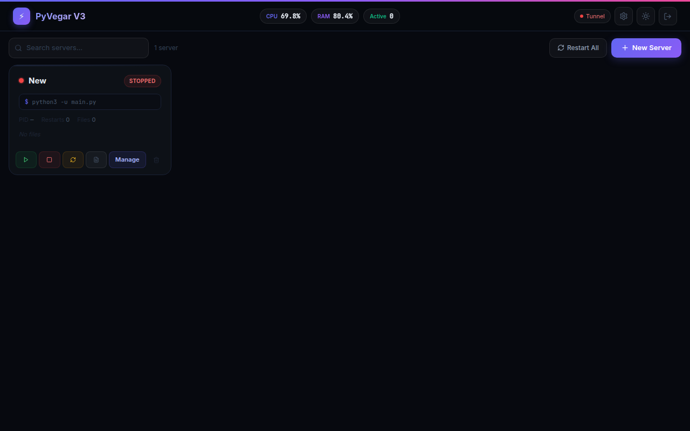
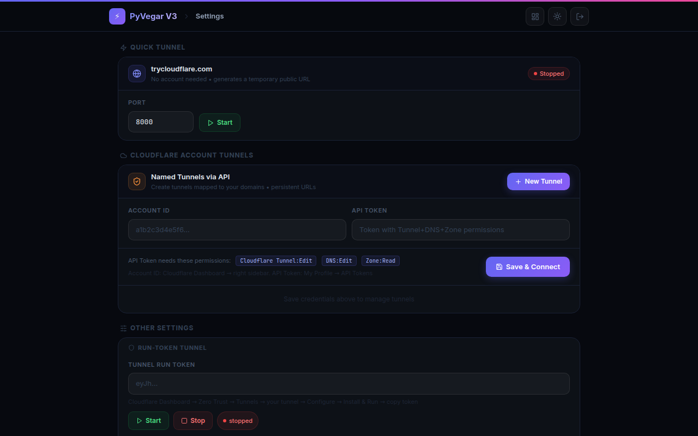
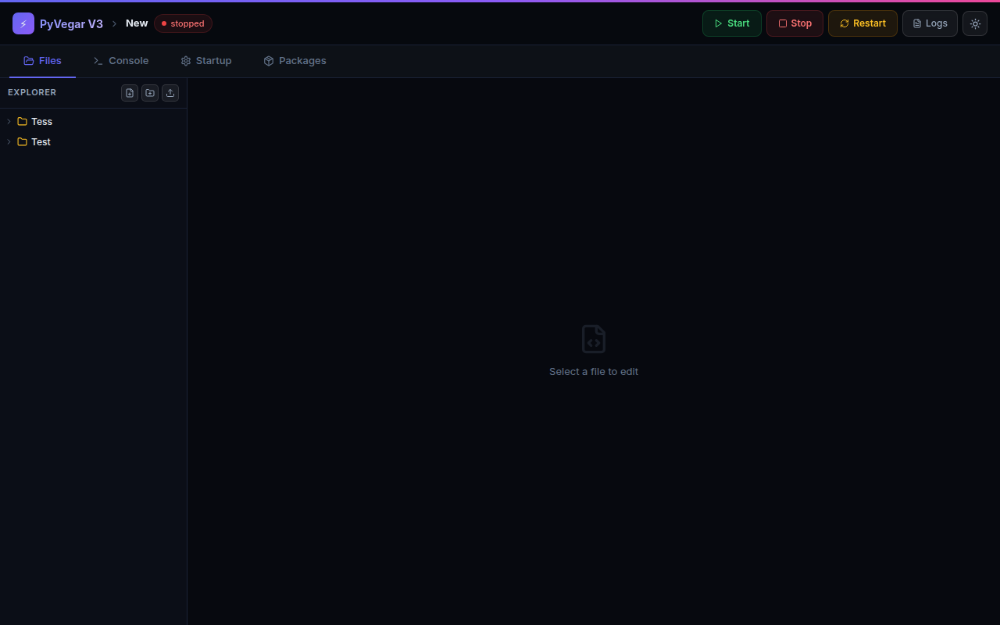
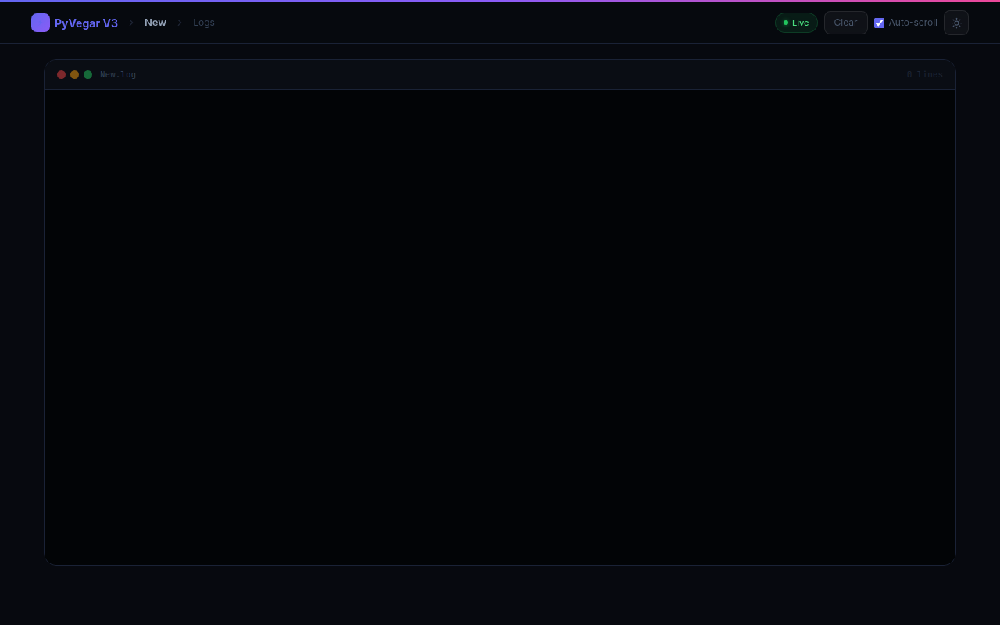
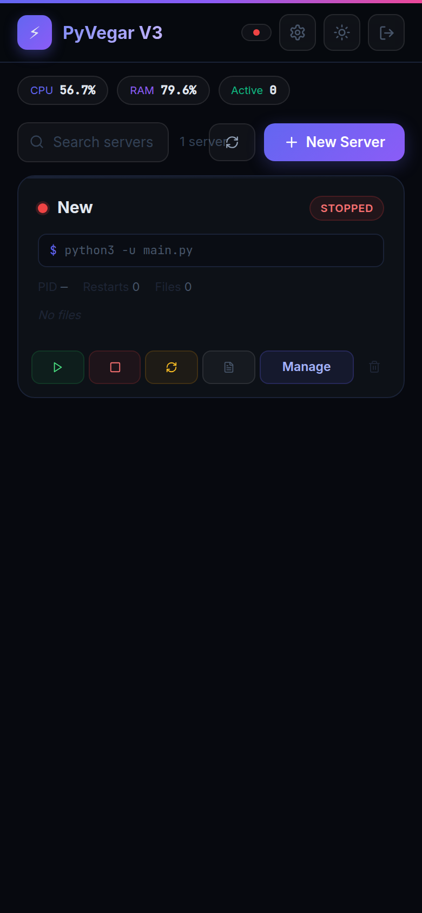
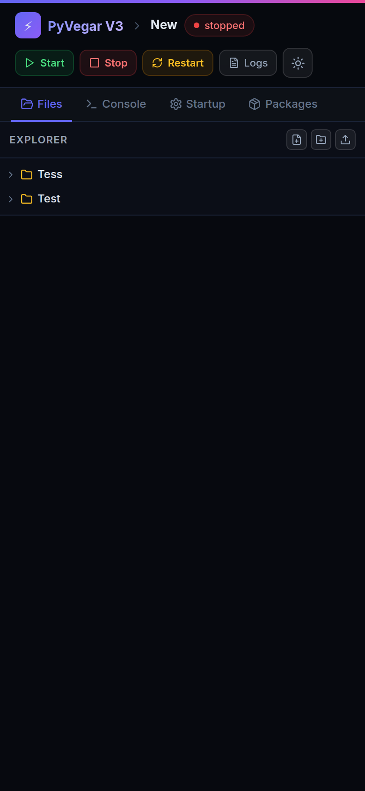

# ⚡ PyVegar V3

[](LICENSE)
[](https://python.org)
[](https://fastapi.tiangolo.com)
[](https://github.com/cdn-worker-7/PyPanel/stargazers)
[](https://github.com/cdn-worker-7/PyPanel/commits/main)

> **PyVegar V3** is a sleek, self-hosted web management panel for running and monitoring Python bots, scripts, and services. Manage multiple projects, edit files in-browser, stream live logs, expose via Cloudflare tunnels, and control everything from Discord — all from a beautiful dark/light UI that works on desktop and mobile.

---

## ✨ Features

- ⚡ **Modern Responsive UI** — Dark/light theme with localStorage persistence, works on mobile and desktop
- 🐍 **Multi-Project Management** — Create, start, stop, restart, and delete Python projects
- 📁 **Full File Manager** — Recursive folder tree, create files/folders inside subfolders, rename, move, delete, upload
- 📝 **In-Browser Editor** — Syntax-aware textarea with Tab indentation and Ctrl+S save
- 📊 **Live Logs & Stats** — WebSocket log streaming, real-time CPU/RAM via WebSocket stats
- 📦 **Package Manager** — Install pip packages directly from the panel
- 🌐 **Cloudflare Quick Tunnel** — No account needed, one-click temporary public URL via trycloudflare.com
- 🔒 **Cloudflare Account Tunnels** — Create named tunnels via CF API, mapped to your own domains with persistent URLs; start/stop/delete from the panel
- 🤖 **Discord Bot** — Control servers via Discord slash commands
- 🔐 **Session Auth** — Cookie-based login with configurable credentials

---

## 🖼️ Screenshots

| Dashboard | Server Manager | Settings |
|-----------|---------------|----------|
|  |  |  |

| File Manager | Live Logs | Mobile Dashboard | Mobile Files |
|-------------|-----------|-----------------|--------------|
|  |  |  |  |

---

## 🚦 Quickstart

```bash
git clone https://github.com/cdn-worker-7/PyPanel.git
cd PyPanel
pip install -r requirements.txt
python app.py
```

Then open [http://localhost:8000](http://localhost:8000) — default login is `admin` / `admin`.

---

## 🔑 Default Credentials

| Field | Value |
|-------|-------|
| Username | `admin` |
| Password | `admin` |

> Change these in **Settings → Panel Login** immediately after first use.

---

## 🧭 Project Structure

```
PyVegar/
├── app.py            # FastAPI app — all routes, auth middleware, WebSockets
├── manager.py        # Project lifecycle, file/folder ops, process control
├── tunnel.py         # Cloudflare quick tunnel + account tunnel API
├── discord_bot.py    # Discord bot for remote control
├── config.json       # Credentials, tokens, CF tunnel data
├── database.json     # Project metadata (status, start file, restarts)
├── requirements.txt  # Python dependencies
├── templates/        # Jinja2 HTML templates (login, index, server, logs, settings)
├── static/           # Static assets
├── scripts/          # Project files (each project gets its own subfolder)
├── logs/             # Per-project log files
└── screenshots/      # README screenshots
```

---

## 🛠️ Tech Stack

| Layer | Tech |
|-------|------|
| Backend | Python 3.11, [FastAPI](https://fastapi.tiangolo.com/) |
| Frontend | HTML5, CSS variables, [Tailwind CDN](https://tailwindcss.com/), [Lucide Icons](https://lucide.dev/) |
| Realtime | FastAPI WebSockets (logs + stats) |
| Tunneling | Cloudflare cloudflared + Cloudflare API |
| Bot | [discord.py](https://discordpy.readthedocs.io/) |
| Process | psutil, subprocess |

---

## 🌐 Cloudflare Tunnels

### Quick Tunnel (no account)
1. Go to **Settings → Quick Tunnel**
2. Enter your local port and click **Start**
3. A temporary `*.trycloudflare.com` URL is generated — URL changes on every restart

### Account Tunnels (persistent URL on your domain)
1. Go to **Settings → Cloudflare Account Tunnels**
2. Enter your **Account ID** (CF Dashboard → right sidebar) and an **API Token** with:
   - `Cloudflare Tunnel:Edit`
   - `DNS:Edit`
   - `Zone:Read`
3. Click **Save & Connect** — your domains are loaded automatically
4. Click **New Tunnel**, pick a subdomain + domain + port
5. The panel creates the tunnel, configures ingress, and adds the DNS CNAME record
6. Click **Start** — your service is now live at `https://subdomain.yourdomain.com`

---

## 🤖 Discord Bot

1. Create a bot at [discord.dev/applications](https://discord.com/developers/applications)
2. Copy the bot token and paste it in **Settings → Discord Bot**
3. Add allowed Discord usernames (comma-separated)
4. The bot responds to slash commands to start/stop/restart projects

---

## 📱 Mobile Support

PyVegar V3 is fully responsive:
- **Dashboard** — card grid adapts to single column on small screens
- **File Manager** — master-detail view: tap a file to open the editor full-screen, tap **← Files** to return to the tree
- **Settings** — all forms stack to single column on small screens
- **Logs** — full-screen terminal view on any device

---

## 📚 Usage Examples

```bash
# Start the panel
python app.py

# Access locally
http://localhost:8000

# Make public via quick tunnel
Settings → Quick Tunnel → Start

# Create a Python project
Dashboard → New Server → name it → Manage → upload/create files → Start
```

---

## 🧑‍💻 Contributing

Pull requests are welcome. For significant changes, open an issue first to discuss what you'd like to change.

---

## 📝 License

**Personal Use Only.** Commercial, educational, or organizational use requires the author's permission. See [`LICENSE`](LICENSE) for full terms.

---

## 📫 Contact

Questions or bug reports? [Open an issue](https://github.com/cdn-worker-7/PyPanel/issues)
